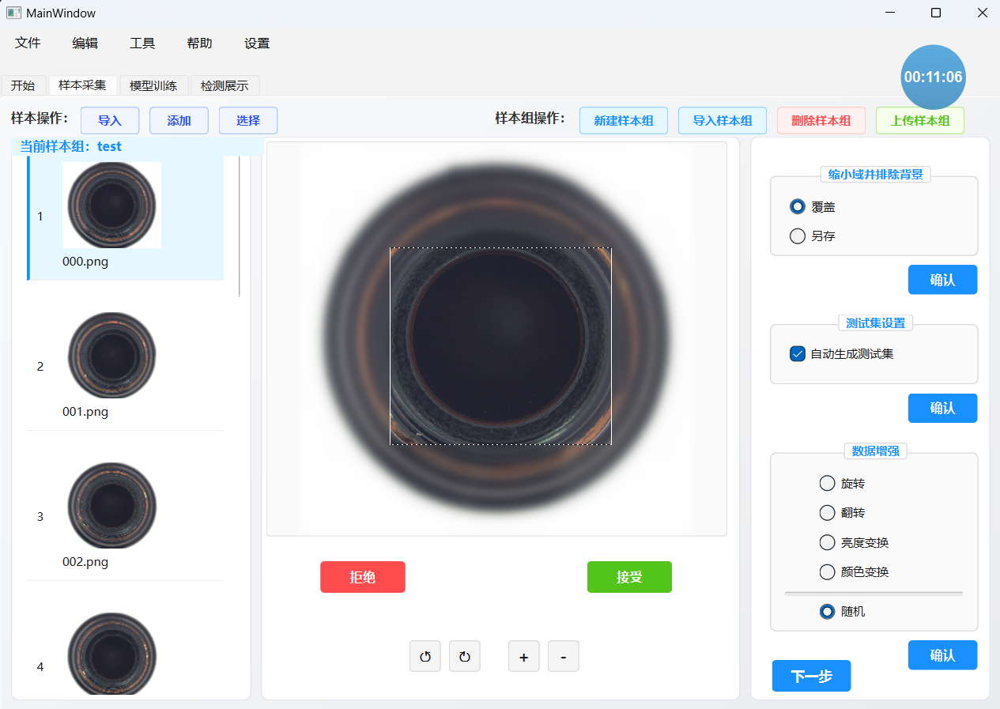
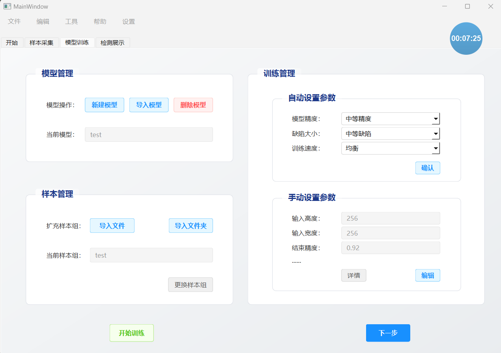
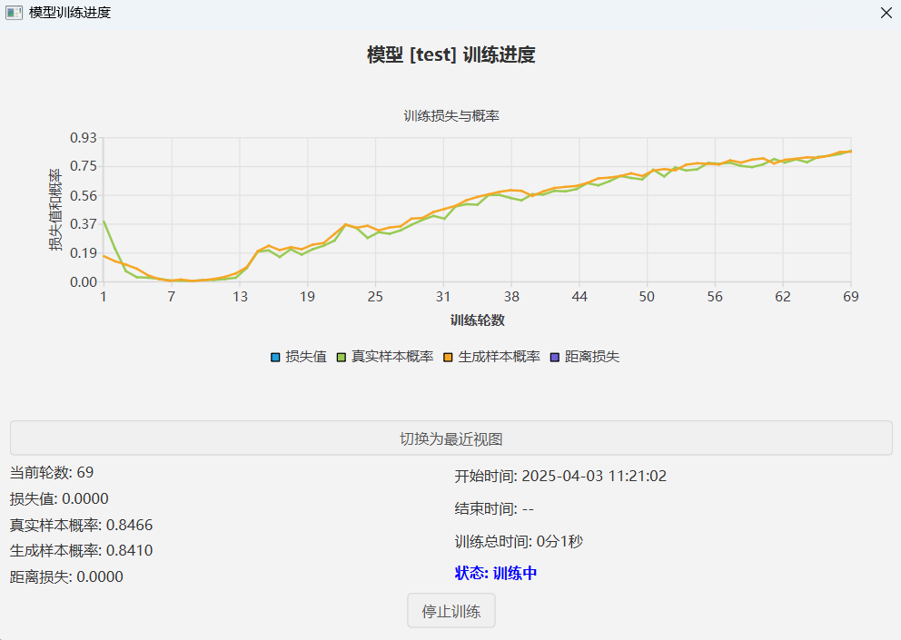
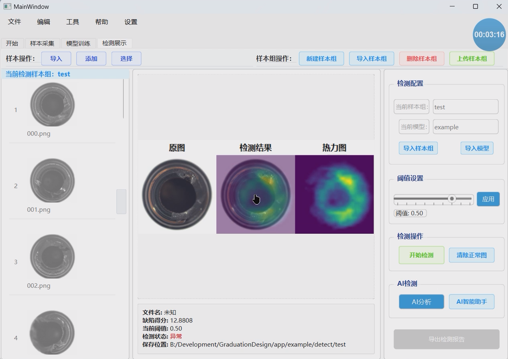
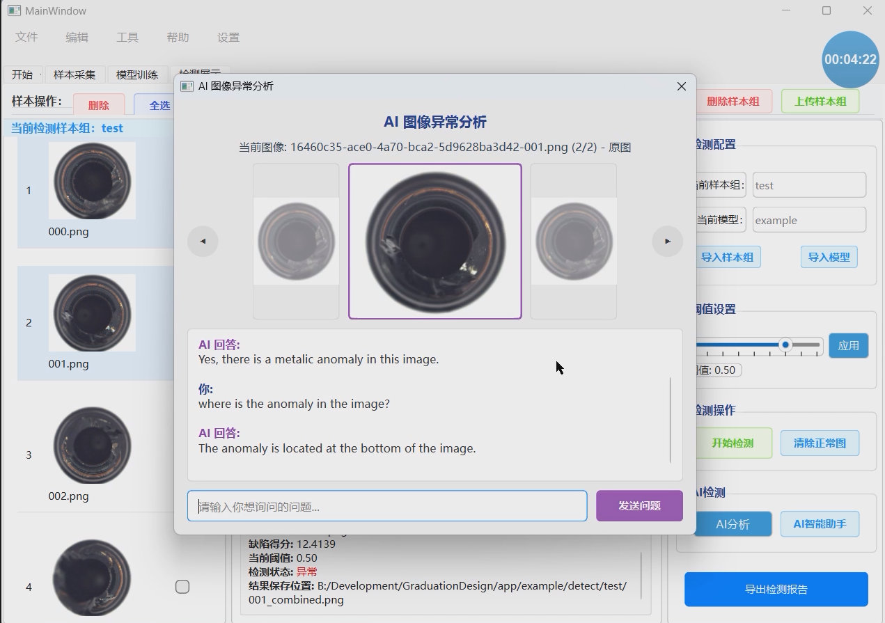
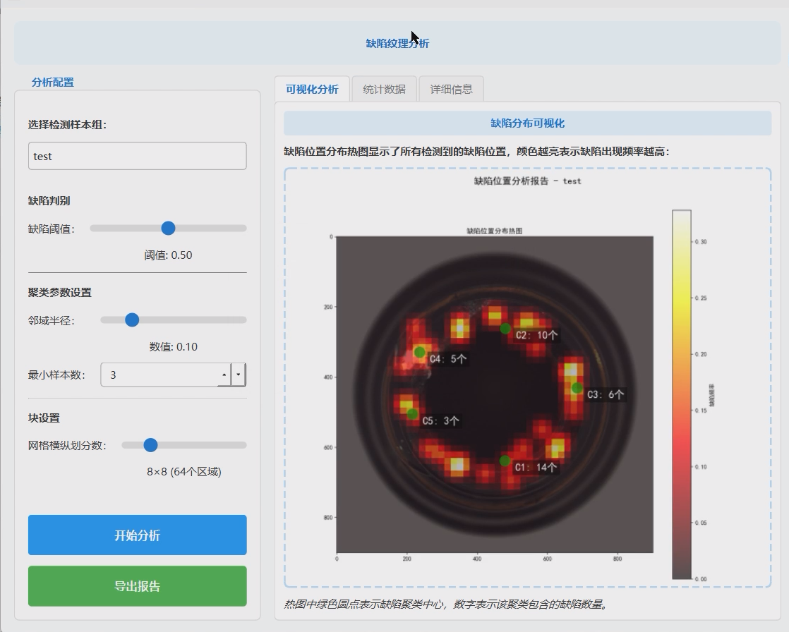
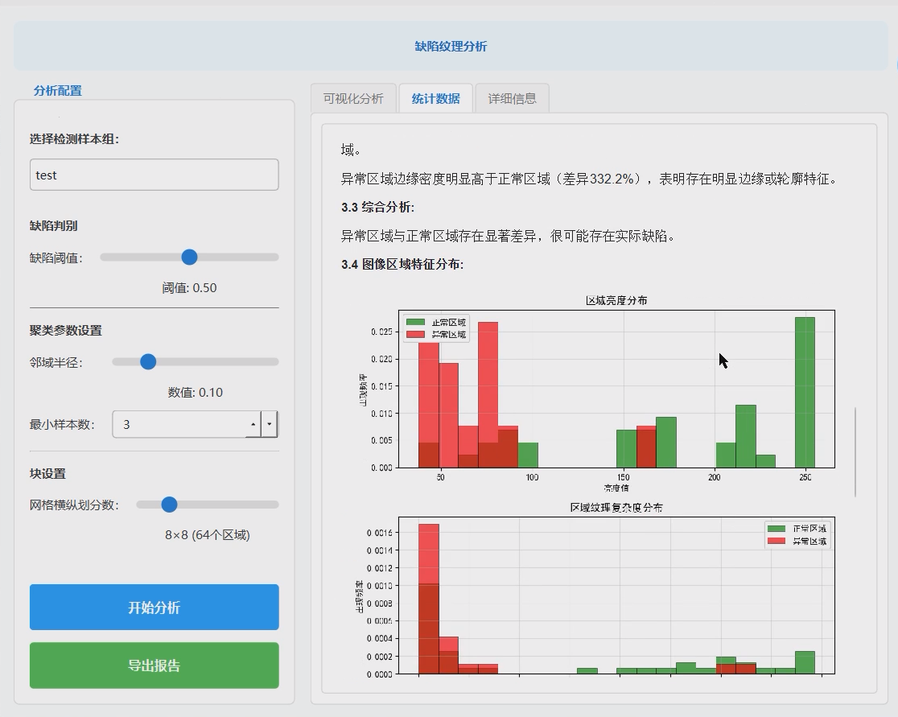
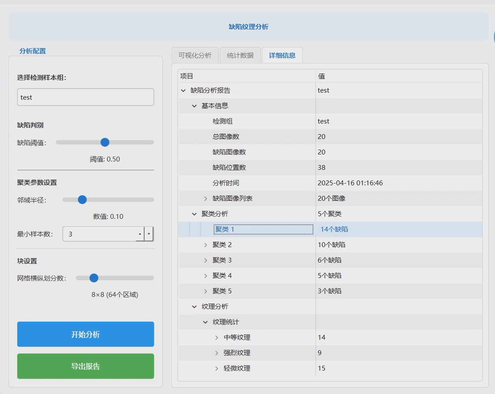

基于无监督学习的缺陷检测系统
---

# 项目简介

    这是一个基于无监督学习的视觉缺陷检测系统，使用Python和PySide6开发的桌面应用程序。该系统主要用于工业视觉缺陷检测场景，无需大量标注样本即可完成异常检测任务。

主要模块包括：

1. **项目管理模块**
   - 支持创建、打开和管理项目
   - 包含悬浮计时器功能
   - 提供历史项目记录与快速加载

2. **样本管理模块**
   - 样本组管理：创建、导入、删除样本组
   - 图像导入与预处理：支持批量导入、裁剪、旋转等操作
   - 数据增强功能：随机几何变换、亮度调整、颜色变换等
   - 伪缺陷生成：支持添加变形、颜色偏移、噪点等伪缺陷
   - 上传功能：将样本上传至远程服务器

3. **模型训练模块**
   - 参数配置：支持精度、缺陷大小、训练速度等参数映射
   - 模型管理：创建、导入、训练模型
   - 训练可视化：实时显示训练进度和性能指标
   - 参数自定义：支持高级参数编辑与保存

4. **检测模块**
   - 检测样本管理：独立于训练样本的检测样本组
   - 服务器连接：连接远程服务器执行检测
   - 结果展示：显示检测结果、热力图、异常标记等
   - 阈值调整：可调整缺陷判定阈值

5. **AI智能判别模块**
   - 基于大模型的缺陷分析
   - 支持多图像对比分析
   - 自然语言对话界面
   - 缺陷原因智能推断功能

6. **检测分析与报告模块**
   - 缺陷数据分析：位置分布、聚类分析等
   - 统计报告：基本统计信息、特征分析等
   - PDF报告生成与导出功能

技术架构：
- 前端：基于PySide6的Qt界面
- 后端：Python实现的服务器通信、模型训练与推理
- 远程服务：支持SSH和HTTP通信的远程模型训练与检测服务
- AI功能：集成DeepSeek大语言模型进行智能分析

项目文件采用特定结构组织，包含元数据、样本组、模型和检测结果等内容。系统通过标签页方式组织界面，引导用户按照样本准备→模型训练→缺陷检测的流程操作。

# 功能列表

## 项目管理模块

### 项目初始化
- 创建新项目
- 打开已有项目
- 历史项目列表，点击打开项目
- 悬浮计时器
- 项目元数据管理
- 最近项目记录与加载
- 拖放功能支持（拖入项目文件夹自动加载）
- 项目导航与快捷键支持

## 引导指示模块

### 操作流程说明
- 引导指示信息
- 跳转到指定模块
- 流程验证（确保按照正确顺序操作）
- 前置条件检查（如样本上传、模型训练等）
- 操作步骤可视化引导

## 样本管理模块

### 样本组管理
- 初始化样本组
- 创建新样本组
- 导入已有样本组
- 删除样本组
- 更新按钮可见性状态
- 样本组有效性检查
- 样本组服务器同步状态管理
- 批量样本处理与导入

### 图像列表管理
- 初始化图像列表
- 折叠/展开图像列表
- 图像选择控制（启用/禁用选择）
- 全选图像
- 删除选定图像
- 图像列表动画加载效果
- 图像项自定义展示

### 图像导入
- 导入目录中的图像
- 复制图像到项目
- 批量导入图像
- 图像格式验证
- 导入进度显示
- 自动排序与组织

### 图像详情管理
- 初始化详情框架
- 清除详情框架
- 显示图像信息
- 刷新详情框架
- 文件路径和元信息展示

### 图像编辑
- 显示裁剪矩形
- 裁剪图像
- 完成裁剪
- 保存图像
- 刷新图像项
- 缩放（放大/缩小）
- 旋转（左旋/右旋）
- 可调整大小的裁剪框

### 数据增强
- 随机选项设置
- 指定选项设置
- 背景排除处理
- 图像增强处理
- 随机增强处理（旋转、翻转、亮度、颜色）
- 测试集生成
- 增强参数配置
- 增强样本预览

### 伪缺陷生成
- 添加变形伪缺陷
- 颜色偏移伪缺陷
- 亮度异常伪缺陷
- 添加噪点伪缺陷
- 添加模糊伪缺陷
- 伪缺陷参数调整
- 伪缺陷效果预览
- 掩码区域定义与编辑

### 上传功能
- 样本上传到服务器
- 上传进度显示
- 上传结果处理
<!-- - 上传状态记录
- 断点续传支持
- 网络错误处理与重试 -->

## 模型训练模块 (model_handler.py)

### 参数映射
- 精度选项映射（低/中/高精度）
- 缺陷大小映射（小/中/大缺陷）
- 训练速度映射（快速/均衡/慢速高质量）
- 获取完整参数配置
- 自定义参数编辑与保存
- 参数有效性验证
- 参数预设模板管理

### 模型管理
- 创建新模型
- 导入已有模型
- 训练模型
- 查看模型参数

### 训练管理
- 训练进度实时显示
- 训练过程动态可视化
- 模型训练状态记录
- 检测过程实时反馈
- 热力图动态生成
- 检测结果实时展示
- 模型性能实时评估图表
- 训练中断与恢复

### 用户界面管理
- 初始化模型选项
- 界面组件交互处理
- 模型列表展示
- 模型信息详情展示
- 参数对话框自定义
- 图表与数据可视化

## 检测模块 (detect_handler.py)

### 检测样本组管理
- 初始化检测样本组
- 创建新检测样本组
- 导入已有检测样本组
- 删除检测样本组
- 更新按钮可见性状态
- 检测样本组有效性检查

### 检测图像管理
- 初始化检测列表
- 导入检测图像目录
- 批量导入检测图像
- 加载检测图像
- 显示选中检测图像
- 删除检测图像
- 图像选择控制（启用/禁用选择）
- 全选检测图像

### 检测结果管理
- 原图/结果图切换显示
- 检测结果信息展示
- 异常/正常状态标记
- 检测阈值调整
- 阈值应用与更新
- 结果保存路径管理
- 结果缓存管理

### 服务器连接
- 连接到检测服务器
- 获取检测结果
- 展示检测结果
- 断开服务器连接
- 检测请求提交
- 检测结果轮询
- 检测进度更新
- 网络错误处理

### 结果展示
- 显示检测结果图像
- 显示检测信息
- 结果分析与展示
- 热力图覆盖显示
- 图像对比工具
- 检测得分显示
- 缺陷概率阈值调整
- 结果图像缩放适配
- 多视图结果展示

## AI智能判别模块 (anomaly_gpt.py)

### 缺陷分析对话
- 多图像对比分析
- 自然语言对话界面
- 缺陷原因智能推断
- 修复建议生成
- 图像导航与浏览
- 原图/结果图切换
- 对话历史记录

### AI服务连接
- 大模型推理请求发送
- 结果解析与展示
- 多模态信息整合
- 批量分析处理
- 实时反馈与进度显示

### 分析结果管理
- 分析结果保存
- 历史分析查询
- 结果导出功能
- 多轮对话支持
- 分析结果可视化

## 检测分析与报告模块 (detect_report.py)

### 缺陷数据分析
- 缺陷位置分布热图生成
- 缺陷聚类分析
- 纹理特征提取与分析
- 区域亮度分布统计
- 区域纹理复杂度分析
- 边缘密度分布统计
- 多维特征对比分析
- 异常区域与正常区域特征对比

### 统计报告
- 基本统计信息展示
- 区域特征直方图生成
- 纹理类型分布饼图
- 聚类结果可视化
- 缺陷分布描述自动生成
- 主要聚类详细分析
- 异常区域特征解读
- 综合分析结论

### 报告导出
- PDF报告生成
- 可视化图表自动嵌入
- 多语言报告支持
- 自定义报告模板
- 分析数据表格导出
- 批量报告生成
- 报告预览功能

## 通用功能

### 用户界面
- 进度显示与反馈
- 错误处理与提示
- 文件对话框交互
- 自定义对话框
- 进度对话框
- 状态栏信息展示
- 确认对话框
- 标签页切换管理
- 流程导航控制

### 文件操作
- 文件路径管理
- 图像文件操作
- 项目数据管理
- 元数据保存与读取
- 配置文件管理
- 检测结果保存
- 项目文件夹结构维护
- 临时文件处理

## 待完善功能

### 多模型比较
- 不同参数模型训练结果对比
- 模型性能对比分析
- 检测结果对比展示
- 最优模型推荐
- 自动参数优化探索
- 集成模型应用

### 个性化定义
- 缩放比例调整
- 界面语言切换
- 界面主题切换
- 界面字体大小调整
- 界面颜色自定义