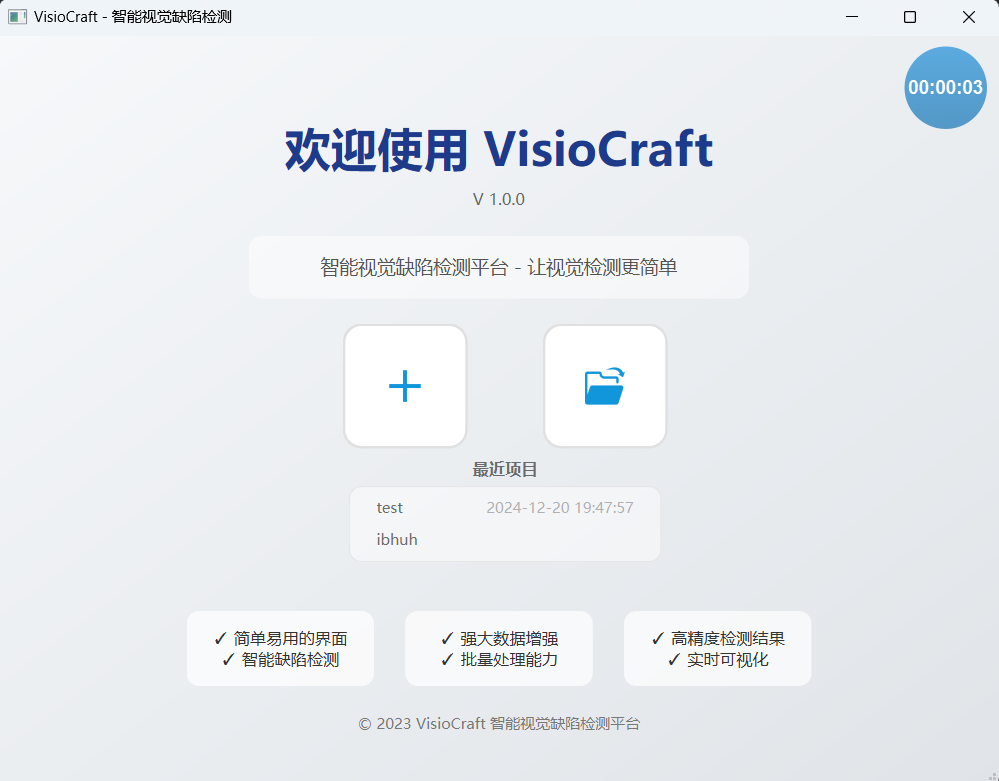
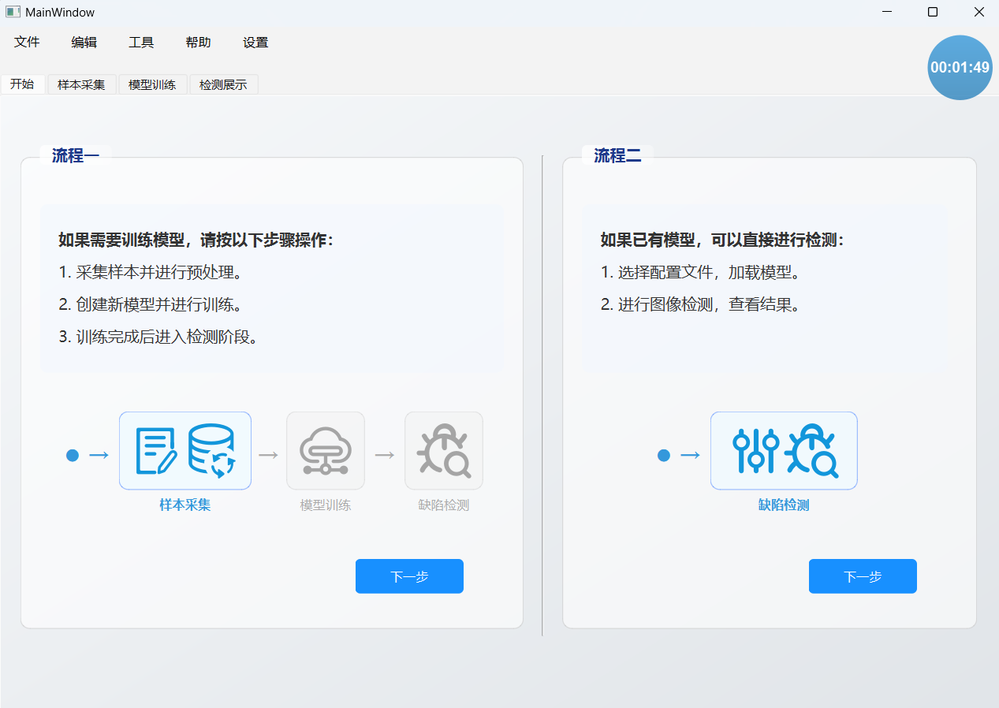
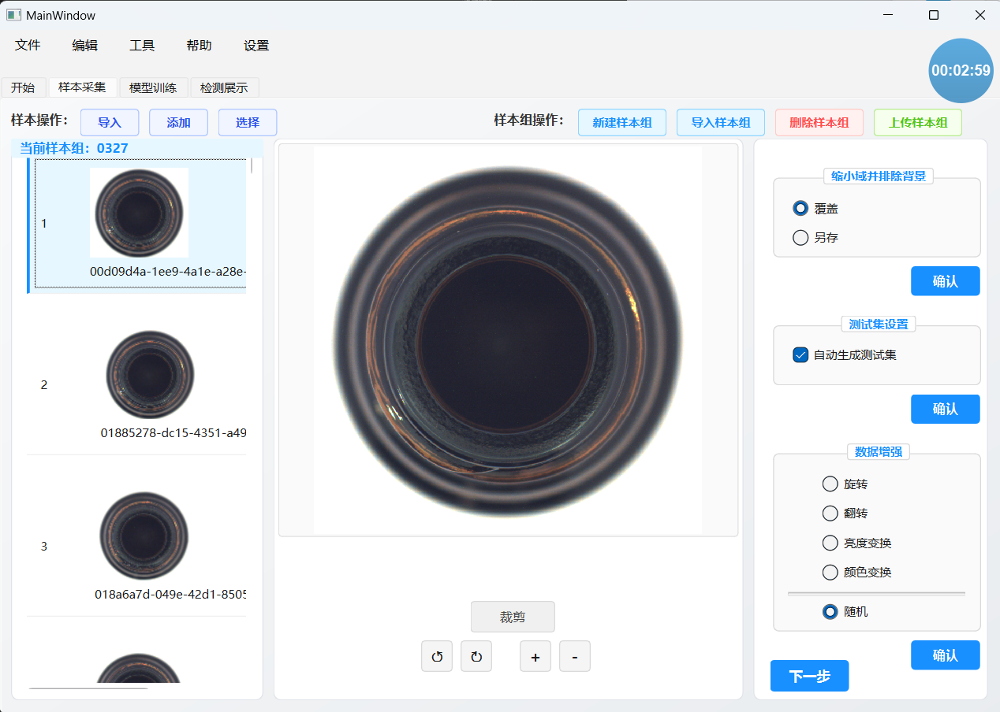
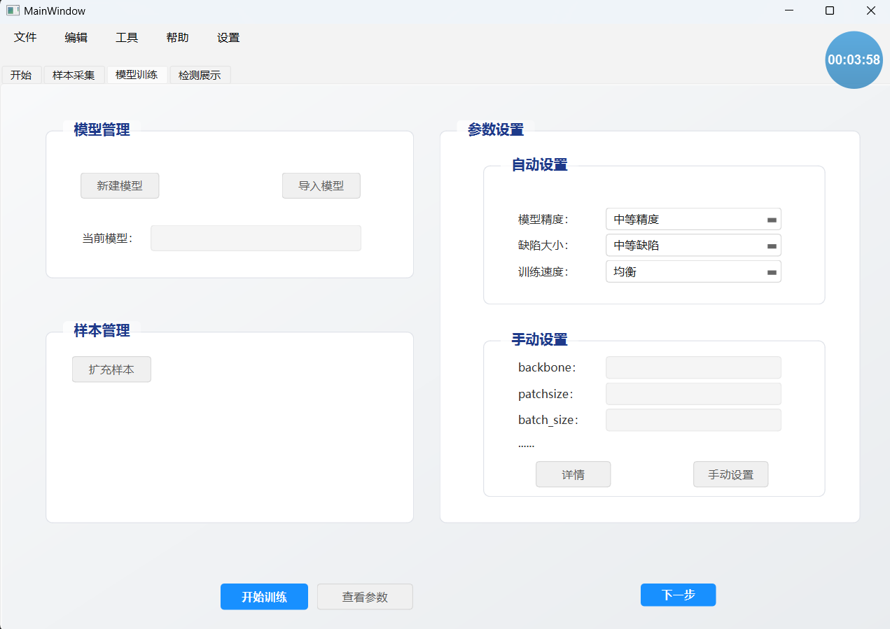
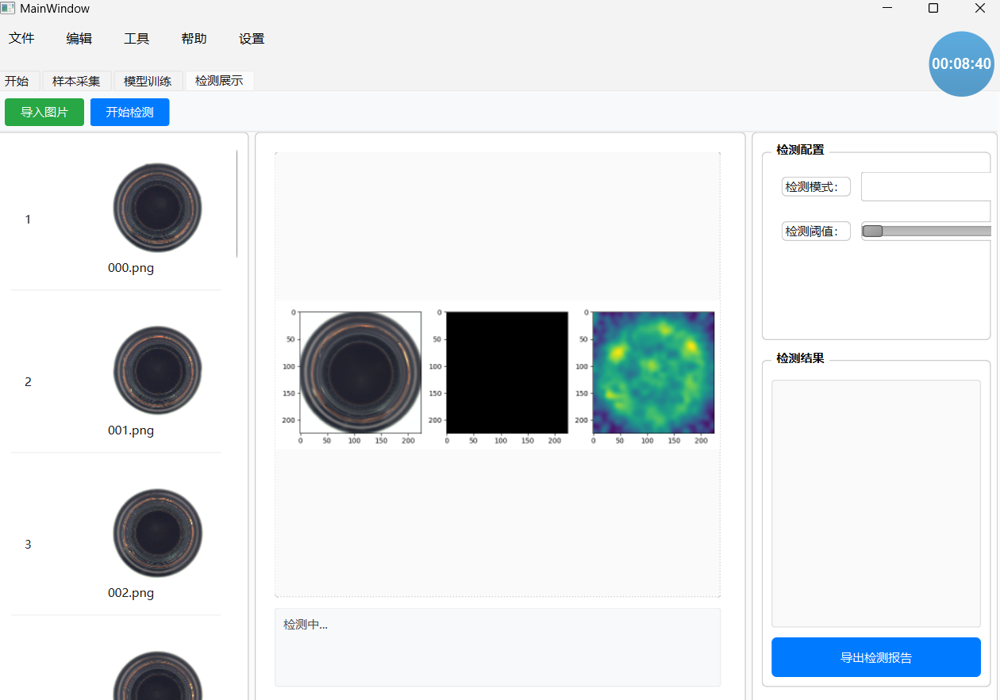

基于无监督学习的缺陷检测系统
---

# 功能列表

## 项目管理模块

### 项目初始化
- 创建新项目
- 打开已有项目
- 历史项目列表，点击打开项目
- 悬浮计时器

## 引导指示模块

### 操作流程说明
- 引导指示信息
- 跳转到指定模块

## 样本管理模块

### 样本组管理
- 初始化样本组
- 创建新样本组
- 导入已有样本组
- 删除样本组
- 更新按钮可见性状态
- 样本组有效性检查

### 图像列表管理
- 初始化图像列表
- 折叠/展开图像列表
- 图像选择控制（启用/禁用选择）
- 全选图像
- 删除选定图像

### 图像导入
- 导入目录中的图像
- 复制图像到项目
- 批量导入图像

### 图像详情管理
- 初始化详情框架
- 清除详情框架
- 显示图像信息
- 刷新详情框架

### 图像编辑
- 显示裁剪矩形
- 裁剪图像
- 完成裁剪
- 保存图像
- 刷新图像项
- 缩放（放大/缩小）
- 旋转（左旋/右旋）

### 数据增强
- 随机选项设置
- 指定选项设置
- 背景排除处理
- 图像增强处理
- 随机增强处理（旋转、翻转、亮度、颜色）
- 测试集生成

### 伪缺陷生成
- 添加变形伪缺陷
- 颜色偏移伪缺陷
- 亮度异常伪缺陷
- 添加噪点伪缺陷
- 添加模糊伪缺陷

### 上传功能
- 样本上传到服务器
- 上传进度显示
- 上传结果处理

## 模型管理模块 (model_handler.py)

### 参数映射
- 精度选项映射（低/中/高精度）
- 缺陷大小映射（小/中/大缺陷）
- 训练速度映射（快速/均衡/慢速高质量）
- 获取完整参数配置

### 模型管理
- 创建新模型
- 导入已有模型
- 训练模型
- 查看模型参数

### 用户界面管理
- 初始化模型选项
- 界面组件交互处理

## 检测模块 (detect_handler.py)

### 检测图像管理
- 初始化检测列表
- 导入检测图像目录
- 加载检测图像
- 显示选中检测图像

### 服务器连接
- 连接到检测服务器
- 获取检测结果
- 展示检测结果
- 断开服务器连接

### 结果展示
- 显示检测结果图像
- 显示检测信息
- 结果分析与展示

## 通用功能

### 用户界面
- 进度显示与反馈
- 错误处理与提示
- 文件对话框交互

### 文件操作
- 文件路径管理
- 图像文件操作
- 项目数据管理

## 待完善功能

### 检测报告
- 计划引入大模型构建检测报告

### 实时反馈
- 才对接好数据，还没来得及生成动态图