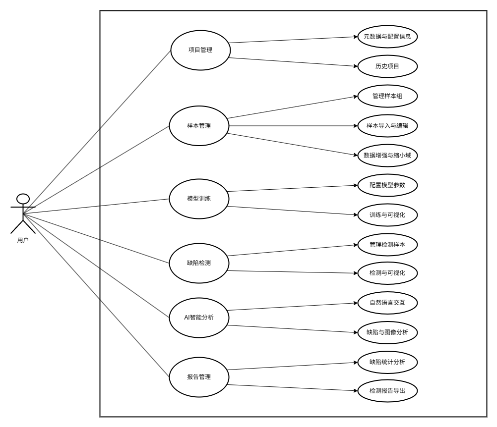

# 摘要

`产品质量是工业制造的基石，随着工业制造智能化进程的加速，产品质量检测的高效性与准确性需求日益提升，而缺陷检测正是工业产品质量检测中不可或缺的一环，它保障了各种工业制品的质量，如金属、芯片、纺织物等，在智能制造领域中扮演着重要角色。显而易见，传统的人工检测方法面临着效率低、成本高、稳定性不足等巨大问题，它注定会被更先进的方法取代。近年来，随着计算机视觉、工业成像、深度学习等领域的技术爆发，基于视觉的工业缺陷检测取得了突破性的进展，它为检测方法的更新迭代提供了新的可能性——构建神经网络对样本进行训练，提取特征，以实现自动化缺陷检测。然而，最初的有监督缺陷检测普遍依赖于大量标注的缺陷数据，这些标注数据不仅难以获得、成本高，且泛化能力相当有限，已不能满足现代化工业生产的需求，由此基于无监督深度学习的缺陷检测方法应运而生。无监督学习方法只需要提供正常样本，通过挖掘其特征就能实现缺陷识别，明显更适用于复杂的工业环境，逐渐成为研究的热点。然而，现有的无监督系统通常存在样本管理不足、检测流程及参数配置复杂、辅助信息有限、多尺度缺陷检测能力不足、界面布局混乱以及功能模块割裂等问题，难以满足工业场景中快速部署的需求。为此，本研究基于开源项目 SimpleNet 和 AnomalyGPT，结合工业检测实际需求，设计并实现了一套集样本管理、模型训练、缺陷检测模块于一体的无监督缺陷监测系统，旨在降低对标注数据的依赖，提升检测的灵活性，同时通过模块化设计与功能优化，提升系统的易用性与适应性`。

`然而，基于规则的传统图像处理算法虽然在特定场景下效果稳定，但对于复杂纹理背景和多样化缺陷类型的适应能力较弱，需频繁调整参数。随着深度学习技术的发展，有监督学习方法通过其在理解和提取产品缺陷特征的优势，在检测精度和检测速度上取得了双重突破，但这类方法面临两大问题：一方面，工业场景中缺陷样本稀缺且多样性强，收集大量带标注的异常样本成本高昂；另一方面，工业生产过程的复杂性导致了缺陷模式和类型变幻莫测，有监督模型对未训练过的新型缺陷类型泛化能力有限，难以适应快速变化的生产工艺。`

## 1.2 国内外研究现状

### 1.2.1 工业缺陷检测技术

在深度学习技术尚未兴起之时，产品表面缺陷检测方法可划分为基于传统图像处理的方法和基于机器学习的方法。基于图像处理的缺陷检测主要分为图像预处理和缺陷检测两个部分，图像预处理包括图像去噪和图像分割等算法，是缺陷检测的前期工作，缺陷检测部分主要利用图像特征提取或模板匹配算法完成对缺陷的检测[4]。基于机器学习的缺陷检测方法通常使用支持向量机(SVM)、`随机森林(Random Forest)等机器学习算法进行缺陷分类，取得了良好的缺陷识别和分类效果。然而，这些方法往往依赖于人为设定的环境，仅适用于处理简单场景和规则缺陷，在现实的复杂工业生产场景中表现不佳。`

`为解决深度学习中缺陷样本稀缺的问题，无监督学习方法逐渐成为研究热点。无监督缺陷检测方法通过使用正常样本进行训练，并学习其分布模式来检测缺陷。它不依赖标注数据，能适应各种各样的缺陷类型。根据数据处理与比较的维度不同，无监督方法可以分为基于图像相似度和基于特征相似度的方法。前者包括自编码器(AE)、变分自编码器(VAE)和生成对抗网络(GAN)等，后者`包括深度一类分类、流模型和教师-学生架构等[1]。

## 1.3 研究内容与主要工作 

`本研究围绕无监督学习的缺陷检测系统的设计与实现展开，基于开源的无监督深度学习检测方法 SimpleNet 和缺陷检测大型视觉语言模型 AnomalyGPT，重点解决现有系统在用户可用性及易用性、工程落地效益等方面的不足。本文`的主要工作分为以下六个部分：  

（1）基于 SimpleNet 构建无监督缺陷检测框架，实现模型训练与检测的核心功能。
（2）基于 AnomalyGPT 实现视觉语言模型辅助判定与分析功能。
（3）实现裁剪、缩小域、数据增强等训练样本预处理操作。
（4）实现样本组和模型的管理，包括模型参数的动态配置。
（5）实现缺陷检测报告功能，完善检测流程。
（6）在实现上述功能的基础上，根据人机交互启发式原则，设计一个用户友好的系统

## 1.4 论文组织结构 

本文围绕无监督学习的缺陷检测系统的设计与实现展开，全文共分为六章，具体组织结构如下：  

`第一章：引言。阐述本文的研究背景、研究意义、研究现状、研究内容及论文结构。`
`第二章：基本概念与相关工作。介绍无监督异常检测的基本概念、系统开发相关的研究工作以及技术栈。`
`第三章：系统设计。对研究项目进行总体描述、需求分析，开展相应的系统架构设计和数据库设计`
`第四章：系统实现。介绍开发环境，详细描述核心模块、接口与其它实现，以及部署方式。`
`第五章：实验。介绍了数据集、实验设计与结果分析。`
`第六章：总结与展望。总结本研究的成果，分析其局限性，并提出未来研究方向。` 

# 第二章 基本概念和相关工作

## 2.1 基本概念

`缺陷是产品表面的物理瑕疵，如裂纹、划痕和凹陷，而异常是图像中不符合正常模式的部分，包括颜色、纹理或形状的异常变化[6]。而在工业上的缺陷检测中，缺陷通常被视作异常。因而，本文中“缺陷”是指在实际生产过程中，由于工艺流程、生产设备和现场环境等因素的影响，造成产品表面出现的各种异常[4]，如瓶底表面的裂纹、划痕，木板表面的磨损，皮革表面的污渍，螺母表面的锈迹等。这些缺陷不仅影响产品的外观，还可能影响其功能和使用寿命，甚至产生安全隐患。`

<!-- 
图 2-3。定性结果。显示了 MVTec AD 中每个类别的采样图像、真实标注(ground truth)和异常热图。 -->

## 2.3 AnomalyGPT

### 2.3.1 AnomalyGPT 概述

`图 2-4。AnomalyGPT、现有 IAD 方法和现有 LVLMs 之间的比较。现有的 IAD 方法只能提供异常分数，需要手动设置阈值，而现有的 LVLMs 无法检测图像中的异常。AnomalyGPT 不仅能提供图像信息，还能指示异常的存在和位置。`

### 2.3.2 AnomalyGPT 分析

## 2.4 技术栈

### 2.4.1 开发框架

`Qt Designer 是 Qt 推出的一款图形化设计 GUI 界面的工具，它允许开发者通过拖放可视化的控件来快速创建复杂的用户界面，而无需编写代码。Qt Designer 不仅提高了 UI 界面的开发效率，还帮助实现了视图和逻辑的分离。在完成界面设计后，开发者只需要关注业务逻辑代码。`

### 2.4.2 数据库

`MySQL 是最流行的开源关系型数据库管理系统，它使用结构化查询语言(SQL)进行数据管理，支持 ACID 特性，兼容 Windows、Linux、MacOS 等各种操作系统。MySQL 具有体积小、速度快、成本低、可靠性高等优点，广泛应用于各类网站和应用程序。`

`Sobel 算子是一种经典的边缘检测算子，主要用于图像处理中识别图像的边缘特征。它通过两个 3x3 的卷积核计算图像中每个像素点在水平和垂直方向的灰度变化，变化较大的区域即边缘位置。Sobel 算子能提取产品表面的边缘信息，帮助识别划痕等线性缺陷，以及分析纹理变化。`

`DBSCAN 是一种基于密度的聚类算法，能够将数据点分为不同的簇，并且能够识别噪声点。它将簇定义为密度相连的点的最大集合，通过邻域半径 ε (Eps) 和最小样本数 MinPts两个参数来控制簇的生成。簇的核心点在其 ε 邻域内至少包含 MinPts 个样本点，边界点不是核心点但在某个核心点的邻域内，噪声点既不是核心点也不是边界点。`

## 2.5 本章小结

`本章阐述了工业缺陷检测的基本概念及相关技术。首先，明确了缺陷和缺陷检测中相关的概念，然后说明了 SimpleNet 方法和 AnomalyGPT 模型的工作原理和优势，最后介绍了本系统所采用的技术栈，包括开发框架、数据库、部署工具，以及使用到的库和算法。`

# 第三章 系统设计

## 4.1 总体描述

### 4.1.1 系统目标

`本系统属于工业质检的辅助工具，旨在帮助用户快速定位工业产品表面的缺陷区域，提高检测效率。作为一款跨平台的桌面应用程序，前端使用 Qt 框架和 PySide6 库进行开发，后端则采用 FastAPI 框架和 MySQL 数据库。系统主要分为样本管理模块、模型训练模块、缺陷检测和报告模块。该应用具有样本编辑管理、模型可视化训练、实时缺陷检测、AI智能判别和自动报告生成等功能，能辅助工业质检人员方便、快捷、直观地识别各类工业产品的表面缺陷，同时根据用户需求平衡检测精度和速度，适应不同尺寸的缺陷检测场景。`

`该系统的算法核心主要基于 SimpleNet 和 AnomalyGPT，能够实现仅基于正常样本的无监督学习、缺陷检测和智能化结果解释。系统能够提供用户友好的界面，如参数配置界面，同时支持专业用户与业余用户操作。特别地，该系统应该尽量满足人机交互启发式原则，如系统状态可见度、一致性和标准化等。另外，该系统应能够支持多线程处理，以保证高效的数据处理能力。`

### 4.1.2 用户特征

`本系统的目标用户是工业质检人员和无监督学习缺陷检测的研究人员，用户的需求是通过使用本系统来高效检测工业产品表面缺陷，提高质检效率并降低人工成本。考虑到工业质检人员的工作背景，部分质检员虽然具备丰富的视觉检测经验，但对深度学习模型的理解和参数配置缺乏专业知识，并且传统检测方式已形成习惯，对计算机辅助检测系统的使用存在一定门槛。研究人员则需要灵活配置系统参数并获取详细的检测结果数据。因此，本系统应尽量简化操作流程，提供直观的参数设置界面，同时为不同需求的用户提供基础到高级的功能选项，既满足质检员快速上手的需求，又能支持研究人员进行深入的算法优化与分析。`

3. `模型训练功能。用户可以通过直观的参数映射系统配置模型，无需深入了解算法细节。系统将专业参数（如嵌入维度、层数、补丁大小等）转换为"精度-速度-缺陷大小"等选项，同时提供训练过程可视化，实时显示训练进度和性能指标。`

6. `检测结果报告功能。用户可查看缺陷数据统计分析，包括位置分布、聚类分析等多维度信息。系统自动生成检测报告，集成各类可视化图表，并支持导出为PDF格式，便于分享和存档。报告内容既包含技术数据，也提供针对工艺改进的实用建议。`

系统用例图如图4-1所示。

## 4.4 数据库设计

### 4.4.1 概述

`本系统采用 MySQL 关系型数据库进行数据存储和管理。基于系统功能需求和数据特性，设计了六表结构，包括样本表、样本组表、模型表、检测结果表，以及用于追踪模型训练和推理过程的模型训练样本关联表和模型推理样本关联表。数据库设计遵循实用性和高效性原则，确保数据的完整性和查询效率。`

## 4.5 本章小结

`本章结合实际工业质检场景对缺陷检测系统进行了全面分析与设计，首先明确了系统作为工业质检辅助工具的目标，然后借助用例详细分析了功能需求和非功能需求，接着通过 “4+1” 视图模型从多角度阐述了系统架构，并将系统划分为四个主要功能模块和十一个子模块，最后设计了数据库结构提供数据支持。`

#### 5.2.1.3 计时器模块

`计时器是项目中的辅助组件，负责跟踪项目操作时间，帮助用户记录和评估工作时长。该模块基于项目中的 FloatingTimer 类实现，贯穿整个应用程序生命周期。`

#### 5.2.2.1 样本组管理模块

`样本组管理模块是样本管理的基础，负责组织和管理样本集合及其状态。如图 5-3 所示，用户可以创建、导入、删除，或上传样本组到服务器，其中导入和删除的管理界面详见图 5-4 ，列出了每个已创建的样本组及其状态。新建或导入样本组后，系统会记录入元数据并在下次打开项目时自动加载。样本组通过样本列表栏显示，样本列表同时支持从目录批量导入样本，以及添加单个或多个样本。导入样本后，点击列表项即可切换到对应样本进行查看与编辑，点击选择按钮后可对样本进行多选或删除。当用户新建、切换或删除样本组后，系统会自动更新样本列表栏与界面显示，同时修改样本组的状态。其中，样本组的状态控制了样本列表操作按钮的可见性，仅当样本组存在时才能进行样本的导入、删除等操作。样本编辑完成后，用户可以上传样本组到服务器，以便后续使用。系统会跟踪上传进度，提供动态反馈。另外，在用户进入模型训练流程前，系统会自动检查样本组是否上传至服务器，以防用户遗漏。仅当上传完成后，方可进行下一步操作。`

#### 5.2.2.2 样本处理模块

`样本处理模块是样本管理的重头戏，负责单个或多个样本的预处理操作，如裁剪、背景排除与数据增强。裁剪和背景排除的目的是相同的，都是为了去除不必要的图像部分，突出重点区域，从而减少背景干扰，提高检测精度；数据增强则通过增加样本多样性，提高模型的泛化能力。`

`背景排除缩小域功能通过智能分割算法识别并保留图像的主体部分，确保后续数据增强以及模型训练集中于目标区域，适用于有明显背景的样本。相比手动裁剪，它可自动化对样本进行批量处理，提高了处理效率。使用 OpenCV 库进行图像阈值处理、轮廓检测和过滤，基于形态学操作进行轮廓优化，消除噪点和细小碎片。具体来说，就是先把图像灰度转换和二值化，以分离前景和背景，然后进行轮廓检测和筛选，保留主要目标区域，最后自动计算目标区域的最小外接矩形，并裁剪图像。另外，为了避免过度裁剪，系统会自动添加适当边距，确保目标的完整性。`

#### 5.2.3.2 训练模块

`训练模块负责模型的实际训练过程，包括训练执行、训练进度可视化以及模型状态控制。训练前系统会自动验证样本组和模型组的有效性，比如样本组是否为空、模型是否处于未训练状态等。启动训练后，进入等待态，同时界面显示加载动画，直至获取到第一轮训练结果。此时开始显示实时训练进度，如图 5-8 所示，显示了动态概率曲线，同时记录了当前训练轮次、训练时间、训练精度等指标。其中训练曲线可视化组件采用 Qt 图表框架构建，定时从服务器拉取训练数据并实时更新图表，并通过 QChart 和 QLineSeries 在坐标轴上实现动态绘制。同时，该组件支持全局视图与局部放大图的切换，便于用户灵活观察整体趋势与细节变化。另外，如果用户急需使用模型，可以随时点击停止训练按钮，终止训练过程。当模型达到结束精度或用户手动终止训练后，模型训练完成，自动恢复空闲状态。同样地，在用户进入缺陷检测流程前，系统会自动检查模型是否被训练并提醒，训练完成后方可进行下一步操作。`

`检测结果图以原图和异常检测热图组合的形式展示，对比清晰，直观地显示了异常区域的位置和大小，热图以颜色表示异常的概率，颜色越深则概率越大，反之亦然。点击中央显示栏，可在结果图与原图之间进行切换。此外，检测结果图下方显示了当前检测的具体信息，包括样本名称、检测时间、检测得分以及检测阈值下的判定状态等。`

`在加载缺陷图像的结果热图后，系统从热图中提取缺陷特征和位置信息。首先，使用 OpenCV 库将检测结果热图转换为灰度图并进行二值化，提取高热区域（缺陷区域）。接着，对每个缺陷区域轮廓进行处理，提取包围框、中心坐标、轮廓面积等几何特征，用于统计缺陷位置。然后获取有效区域的灰度均值、标准差和最大值，并通过 Sobel 算子计算梯度均值，用于进行缺陷纹理分析。至此构建出完整的缺陷位置与纹理特征向量。`

`亮度分布直方图用于区分亮度异常导致的缺陷，如过曝、过暗或局部高反差区域；纹理复杂度分布直方图用于区分纹理异常导致的缺陷，如纹理断裂、杂乱或缺失；边缘密度分布直方图用于识别边缘异常，如裂纹、划痕或轮廓缺失等几何特征缺陷。绿色和红色分别表示正常区域和异常区域的分布情况。`

`接着，分析并统计检测样本的缺陷类型。参考之前提取的位置信息和纹理特征信息，根据缺陷亮度阈值以及归一化面积构建四级缺陷等级，从轻微污染到严重损坏，缺陷程度依次递增，结果使用饼图展示，详见图 5-14 。针对每个缺陷等级，进一步细分为总共八类具体缺陷形态，如划痕、裂缝、缺口等。`

，包含缺陷类型分布图

所有分析完成后，系统会通过结构化的报告展示分析结果，用户浏览完毕后可以下载 pdf 报告。检测报告界面包含可视化分析、统计数据、详细信息三个标签页。可视化分析页面主要展示了缺陷位置分布图。统计数据页面共分为五个部分：（1）基本信息，描述了检测样本组的基本信息。（2）缺陷位置分析，展示了缺陷的空间分布特点以及聚类结果。（3）区域特征统计，对比了正常区域与异常区域在亮度、纹理复杂度和边缘密度三个维度上的差异。（4）缺陷类型统计，分析了所有缺陷区域，统计了每类缺陷的细分缺陷数量以及样本数量。（5）`结论分析，基于前面的统计分析结果，简要推断可能的缺陷原因，并给出相应的改进建议。详细信息页面采用树状结构，从基本信息到聚类分析，再到缺陷类型统计，每一层级都可展开查看细节数据，详见图 5-15 。`

（2）事件过滤器处理点击事件

`系统采用 Qt 的事件过滤器（Event Filter）组件处理点击事件，如 AI 分析模块中的交互式图像查看，点击当前图像即可无缝切换原图和结果图，方便用户直观地对比。事件过滤器可以拦截特定组件的事件流，实现对组件的自定义处理，这种非侵入式设计将处理逻辑与 ui 组件分离，提高了扩展性。`

(5) 人机交互启发式原则在系统中的体现

`系统通过多种方式体现人机交互启发式原则。首先，帮助和文档方面，用户在打开项目后会看到流程引导。在依赖识别而非记忆方面，每个按钮都配有直观可识别的图标。系统在一致性和标准化上，采用统一的UI设计，确保不同界面的布局和样式风格保持一致。系统状态的可见度通过加载进度和加载动画来反馈操作的处理情况。系统与现实世界的吻合体现在其缺陷检测流程上，模拟了现实中样本采集、模型训练、缺陷检测、AI辅助分析和报告生成的过程，类似于工人观摩样本、肉眼检测缺陷、高级质检人员辅助分析及手动书写报告的实际操作。为避免出错，系统在检测时会禁用界面上的组件以限制用户行为。帮助用户识别、诊断和恢复错误方面，系统通过弹窗显示错误信息，例如在新建项目时输入名称格式非法时进行提示。最后，系统的使用灵活性和高效性体现在支持拖拽文件打开项目、新建样本组或模型时可直接按回车键确认，以及切换页面时自动提醒是否上传样本组或训练模型。`

## 5.4 部署

### 5.4.1 服务器端部署

服务器由哈工大多模态智能及应用研究中心支持，项目运行于 ubuntu 22.04 环境，将服务器端打包为镜像后可快速部署于任意服务器上运行。

### 5.4.2 客户端部署

<!-- pyinstaller start.py --workpath d:\pybuild  --distpath d:\pybuild\dist --hidden-import opencv-python --add-data "ui;ui" -->
<!-- # 在程序启动时设置工作目录为应用程序所在目录!!!
os.chdir(os.path.dirname(os.path.realpath(__file__))) -->

`客户端通过 PyInstaller 打包为可执行文件，包含源代码、ui 文件，以及 PySide6 等库文件，可部署在 Windows 11 64 位操作系统上运行。值得注意的是，使用 PyInstaller 打包时，需要显式导入 opencv 库，以及 ui 文件夹。另外，打包后运行可执行文件时，应用界面可能会出现图片无法正常显示的问题，这是因为 exe 文件的运行目录与 ui 文件夹的相对位置发生了变化。本系统采取的解决办法是在程序启动时设置工作目录为应用程序所在目录。`

## 5.5 本章小结

`本章详细阐述了缺陷检测系统的具体实现过程，从开发环境到十一个子模块的实现再到部署落地方案，均进行了系统性描述。另外，本章还介绍了系统中的一些用于优化用户体验的处理，如异步处理、事件过滤器、裁剪功能和流程引导等，它们严格遵循了人机交互的八大启发式原则，共同构建了一个友好、高效、易用的系统。`

`MVTec 异常检测数据集的五个纹理和十个对象类别的示例图像。对于每个类别，都显示了一个无异常和异常的示例。上面一行显示了输入图像，下面一行是特写视图。`

### 6.4.2 AnomalyGPT 辅助分析

`如表 6-3 所示，在 bottle 测试集的三类样本中，AnomalyGPT 辅助分析异常是否存在的准确率均达到了 100%，效果出色。但是，在缺陷位置的准确率上，表现一般。尤其是在大缺陷样本中，准确率仅为 70%，这表明 AnomalyGPT 在辅助分析时，容易被大范围的异常区域干扰，导致无法准确地定位缺陷位置。实验中发现，出错最多的情况是当检测到瓶底四周都有异常时，AnomalyGPT 会认为缺陷位于瓶底中心，这是 AnomalyGPT 可能需要改进的地方。`

CLASS                   EXISTANCE_ACC    POSITION_ACC

GOOD                         100%               -
SMALL_DEFECT               100%                 86.3%
BIG_DEFECT                100%                  70%

## 6.5 本章小结

`本章对缺陷检测系统进行了一些实验。首先，介绍了实验用到的 MVTec AD 数据集以及评估指标。然后，设计实验验证了 SimpleNet 异常检测模型在不同精度和速度的选择下的结果，以及 AnomalyGPT 辅助分析模型在判定异常存在性和定位缺陷位置的效果。最后，对实验结果进行了分析，证实了精度与速度选择的设定是合理的。`

# 第七章 总结与展望  

## 7.1 工作总结  

`本研究针对工业缺陷检测领域所面临的标注数据稀缺、缺陷多样化、现有系统操作及配置复杂等问题，设计并实现了一套基于无监督深度学习的工业缺陷检测系统。系统以开源的无监督检测方法 SimpleNet 为核心，结合 AnomalyGPT 大型视觉语言模型的辅助分析能力，构建了样本管理、模型训练和缺陷检测三大功能模块。在样本管理方面，通过动态样本组管理和样本预处理如数据增强等操作解决了工业场景中样本质量参差不齐和多样性不足的痛点。模型训练模块创新性地设计了参数映射功能，将复杂的深度学习参数抽象为“精度-速度-缺陷大小”等直观选项，降低了非专业用户的操作门槛，同时保留手动参数配置以满足研究需求。缺陷检测模块融合了 SimpleNet 的高效异常检测与 AnomalyGPT 的自然语言交互能力，通过可视化的结果热图、AI 辅助分析，以及完善的缺陷检测报告，实现了从缺陷定位到工艺优化的全流程支持。实验结果表明，系统在 MVTec AD 数据集上表现优异，其中默认情况下 SimpleNet 模型在胶囊类样本的 I-AUROC 达到 98.4%，且单张图像检测时间为 22ms 左右，AnomalyGPT 对异常存在性判定的准确率达 100%。此外，系统采用 Qt 框架实现了跨平台部署，通过模块化设计和异步处理机制保障了界面响应速度与稳定性，同时参照人机交互启发式原则对系统界面进行优化，最终实现了一套兼具高效性、易用性和可解释性的工业质检工具，为智能工业制造场景中的缺陷检测提供了高效且实用的解决方案。`

## 7.2 未来展望  

`尽管缺陷检测系统在精度与实用性上取得了良好效果，但仍存在一些局限性和改进空间。未来研究方向主要包括完善系统功能、改造系统框架、优化检测算法、升级系统架构、促进工业落地这几个方面：首先，可探索多种算法融合框架，让用户能够根据实际场景与工业产品动态选择最适合的检测算法。其次，可尝试结合了有监督与无监督深度学习的优势的半监督方法，通过少量标注数据提升缺陷检测的性能。再者，可考虑扩展系统输入，支持多模态数据来进行融合分析，比如红外、超声波等其它传感器数据，同时开发实时检测模式以满足高速生产线的需求。然后，可试着通过分布式数据库优化和云端协同计算提升系统处理大规模数据的效率，同时构建用户权限管理与数据共享机制，增强企业级应用的协作能力。最后，与企业合作，对细化的制造领域进行专项优化，获取相关领域数据对大模型进行微调，完善 AI 辅助分析以及缺陷检测报告，增强系统对生产工艺优化的帮助，以期做到真正的智能化制造。`

