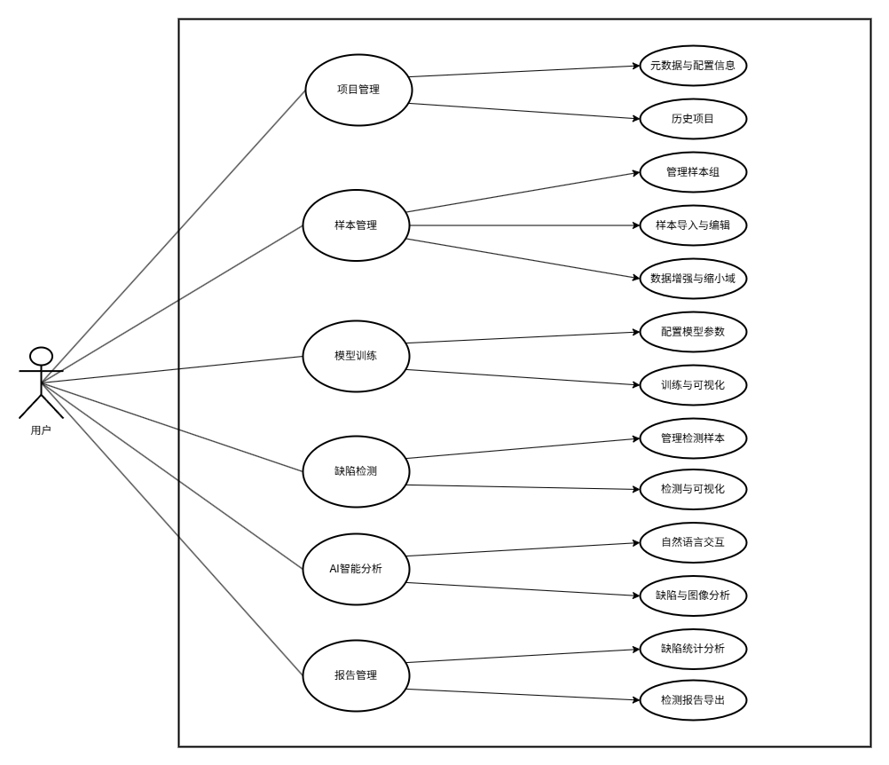

基于无监督深度学习的工业缺陷检测系统的设计和实现

[1] 2
[2] 韩慧. 基于深度学习的工业缺陷检测方法研究[D]. 2019.
[3] 赵君爱．基于图像处理的工件表面缺陷检测理论与方法研究[D]. 南京: 东南大学，2016.
[4] 3
[5] 汤勃，孔建益，伍世虔. 机器视觉表面缺陷检测综述[J]. 中国图象图形学报，2017,22(12): 1640-1663.
<!-- TOC tocDepth:2..3 chapterDepth:2..6 -->

- [摘要](#摘要)
- [第一章  引言](#第一章-引言)
  - [1.1 研究背景及意义](#11-研究背景及意义)
  - [1.2 国内外研究现状  （引用核心论文或开源项目）](#12-国内外研究现状-引用核心论文或开源项目)
    - [1.2.1 传统图像处理方法阶段](#121-传统图像处理方法阶段)
    - [1.2.2 有监督深度学习方法阶段](#122-有监督深度学习方法阶段)
    - [1.2.3 无监督深度学习方法阶段](#123-无监督深度学习方法阶段)
  - [1.3 当前存在的主要问题](#13-当前存在的主要问题)
  - [1.4 研究内容与主要工作](#14-研究内容与主要工作)
  - [1.5 论文组织结构](#15-论文组织结构)
  - [1.6 本章小结](#16-本章小结)
- [第二章 基本概念和相关工作](#第二章-基本概念和相关工作)
  - [2.1 无监督缺陷检测介绍](#21-无监督缺陷检测介绍)
    - [2.1.1 工业缺陷检测](#211-工业缺陷检测)
    - [2.1.2 无监督深度学习](#212-无监督深度学习)
  - [2.2 工业级缺陷检测系统](#22-工业级缺陷检测系统)
    - [2.2.1 HALCON](#221-halcon)
    - [2.2.2 DeepVision](#222-deepvision)
  - [2.3 本章小结](#23-本章小结)
- [第三章 关键技术分析](#第三章-关键技术分析)
  - [3.1 SimpleNet](#31-simplenet)
    - [3.1.1 算法核心思想](#311-算法核心思想)
    - [3.1.2 算适用场景与局限性](#312-算适用场景与局限性)
    - [3.1.3 选择该算法的原因](#313-选择该算法的原因)
  - [3.2 AnomalyGPT](#32-anomalygpt)
    - [3.1.1 大模型原理](#311-大模型原理)
    - [3.1.2 适用场景与局限性](#312-适用场景与局限性)
    - [3.1.3 选择该模型的原因](#313-选择该模型的原因)
  - [3.3 技术栈](#33-技术栈)
    - [3.3.1 开发框架](#331-开发框架)
    - [3.3.2 数据库](#332-数据库)
    - [3.3.3 部署工具](#333-部署工具)
- [第四章 系统设计](#第四章-系统设计)
  - [4.1 需求分析](#41-需求分析)
    - [4.1.1 总体描述](#411-总体描述)
    - [4.1.2 功能性需求](#412-功能性需求)
    - [4.1.3 用例描述](#413-用例描述)
    - [4.1.4 非功能性需求](#414-非功能性需求)
  - [4.2 系统架构设计](#42-系统架构设计)
    - [4.2.1 总体设计](#421-总体设计)
    - [4.2.2 模块划分](#422-模块划分)
  - [4.3 数据库设计](#43-数据库设计)
- [第五章 系统实现](#第五章-系统实现)
  - [5.1 开发环境](#51-开发环境)
  - [5.2 核心模块实现](#52-核心模块实现)
    - [5.2.1 算法调用关键代码](#521-算法调用关键代码)
    - [5.2.2 模块间通信机制/API设计](#522-模块间通信机制api设计)
  - [5.3 部署](#53-部署)
    - [5.3.1 服务器端部署](#531-服务器端部署)
    - [5.3.2 客户端部署](#532-客户端部署)
  - [5.3 界面展示](#53-界面展示)
- [第六章 测试与分析](#第六章-测试与分析)
  - [6.1 数据集](#61-数据集)
  - [6.2 实验设计](#62-实验设计)
  - [6.3 结果分析](#63-结果分析)
- [第七章 总结与展望](#第七章-总结与展望)
  - [7.1 工作总结](#71-工作总结)
  - [7.2 未来展望](#72-未来展望)

<!-- /TOC -->
# **摘要**  

产品质量是工业制造的基石，随着工业制造智能化进程的加速，产品质量检测的高效性与准确性需求日益提升，而缺陷检测正是工业产品质量检测中不可或缺的一环，它保障了各种工业制品的质量，如金属、芯片、纺织物等，在智能制造领域中扮演着重要角色。显而易见，传统的人工检测方法面临着效率低、成本高、稳定性不足等巨大问题，它注定会被更先进的方法取代。近年来，随着计算机视觉、工业成像、深度学习等领域的技术爆发，基于视觉的工业缺陷检测取得了突破性的进展，它为检测方法的更新迭代提供了新的可能性——构建神经网络对样本进行训练，提取特征，以实现自动化缺陷检测。然而，最初的有监督缺陷检测普遍依赖于大量标注的缺陷数据，这些标注数据不仅难以获得、成本高，且泛化能力相当有限，已不能满足现代化工业生产的需求，由此基于无监督深度学习的缺陷检测方法应运而生。无监督学习方法只需要提供正常样本，通过挖掘其特征就能实现缺陷识别，明显更适用于复杂的工业环境，逐渐成为研究的热点。然而，现有的无监督系统通常存在多尺度缺陷检测能力不足、功能模块割裂、参数配置复杂、实时性不足等问题，难以满足工业场景中快速部署的需求。为此，本研究基于开源算法SimpleNet和AnomalyGPT，结合工业检测实际需求，设计并实现了一套集样本管理、模型训练、缺陷检测模块于一体的无监督缺陷监测系统，旨在降低对标注数据的依赖，提升检测的灵活性，同时通过模块化设计与功能优化，提升系统的易用性与适应性。具体研究内容如下：
1. 针对样本类型多种多样、样本数量稀缺、样本质量参差不齐等问题，设计了由动态样本组管理、数据增强与样本编辑操作等部分构建的样本组管理模块。
2. 针对自监督缺陷检测依赖大量标注数据、模型训练参数设置复杂，以及系统模型管理困难等问题，设计了由基于SimpleNet的无监督缺陷检测功能、用户导向的参数映射功能与模型状态管理等部分构建的模型训练模块。其中，参数映射将复杂模型参数简化为"精度-速度-缺陷大小"等直观选项，降低操作门槛。
3. 针对检测结果仅通过阈值判定、检测结果单一、辅助信息有限等问题，设计了由基于AnomalyGPT的大模型辅助判定与交互功能、检测报告等部分构建的缺陷检测模块。系统通过热图可视化、大模型交互与检测报告，为工艺优化提供支持，具有一定的工业落地价值。

**关键词**：计算机视觉；无监督深度学习；工业缺陷检测；自动化检测；缺陷检测系统；

# 第一章  引言

## **1.1 研究背景及意义**  

在人类现代社会生活的各个方面，不论是衣食住行，亦或是晨昏四季，工业制品都无处不在。《中国制造 2025》行动纲领指出，建设制造强国任务艰巨而紧迫，需要加速推进信息化与工业化的深度融合，推进生产过程的智能化[1]。众所周知，在工业制造智能化进程中，产品质量的把控始终是提升工业生产经济效益的关键环节，而这一环离不开产品的缺陷检测。通过缺陷检测能够有效把控产品质量、检测流水线机器的工作状态以及评估生产制造技术的优良，对提高产品质量和生产效率、降低生产成本有着至关重要的作用[2]。因此，基于视觉的工业缺陷检测不仅有非常重要的研究价值，同时也拥有广阔的应用前景[1]。在传统的工业生产过程，缺陷检测主要依靠人工视觉，不仅具有检测效率低、误检率和漏检率高、人工成本高、实时性差、主观误差高的缺点，还有接触损伤的风险。同时，在缺陷尺寸小于 0.5 mm 且无较大光学形变时，人眼检测不到缺陷信息，不适用于大规模工业生产的要求[3]。

后来，随着计算机图像处理技术的突破，机器视觉有效地解决了缺陷检测中人工的弊端。机器视觉检测技术是一种非接触式的自动检测技术，具有安全可靠、检测精度高、可在复杂的生产环境中长时间运行等优点，是实现工厂生产自动化和智能化的一种有效方法[4]。因而机器视觉逐渐取代人工视觉，成为工业缺陷检测的主力。目前，基于机器视觉的缺陷检测技术已广泛应用于工业产品的质量检测、分类检测和包装检测等，涉及钢板、玻璃、印刷、电子、纺织品、零件、木材、钢轨、瓷砖等多种关系国计民生的行业和产品[5]。

然而，基于规则的传统图像处理算法虽然在特定场景下效果稳定，但对于复杂纹理背景和多样化缺陷类型的适应能力较弱，需频繁调整参数。随着深度学习技术的发展，有监督学习方法通过其在理解和提取产品缺陷特征的优势，在检测精度和检测速度上取得了双重突破，但这类方法面临两大问题：一方面，工业场景中缺陷样本稀缺且多样性强，收集大量带标注的异常样本成本高昂；另一方面，工业生产过程的复杂性导致了缺陷模式和类型变幻莫测，有监督模型对未训练过的新型缺陷类型泛化能力有限，难以适应快速变化的生产工艺。

近年来，基于无监督学习的缺陷检测技术因其能自动学习潜在特征和模式，仅需正常样本即可完成训练的特性，逐渐成为研究热点。经研究发现，现有的无监督检测方法存在三个缺陷：第一，计算复杂度高，如部分基于生成对抗网络(GANs)的方法虽然检测精度较高，但运算开销大，难以满足工业实时检测需求；第二，参数配置专业性强，增加了工程部署门槛，不利于非专业用户使用；第三，检测结果信息量少，对于工业制造中的缺陷检测所能提供的辅助作用低下。此外，大多数现有方法仅提供异常评分而不能直接判断异常，需要人工设置阈值，这在动态变化的生产环境中缺乏灵活性。

本文旨在对基于无监督深度学习的缺陷检测算法模型如何向实际工业应用进行转化，以及相应缺陷检测系统的设计与开发展开研究。结合已有的开源算法模型，设计一套面向工业实际应用场景的无监督缺陷检测系统，致力于解决训练数据稀缺且质量参差不齐、模型检测速度与精度难以平衡、模型参数配置复杂、检测效益低下等问题，提高检测效率与准确性，降低检测成本与学习成本，帮助优化生产工艺，从而提高产品质量，提升生产制造的效益，最终实现促进工业智能制造的发展的目标。

## **1.2 国内外研究现状**  （引用核心论文或开源项目）

工业缺陷检测技术经历了从人工检测到计算机视觉自动检测的发展历程。随着深度学习技术的发展，缺陷检测方法也经历了从传统图像处理方法、有监督深度学习方法到无监督深度学习方法的演进。本节将对工业缺陷检测无监督深度学习方法的三个研究阶段进行展开。

### **1.2.1 传统图像处理方法阶段**

在深度学习兴起前，主要依赖边缘检测、形态学运算、特征提取等传统方法。例如，通过阈值分割、边缘检测、形态学操作等技术实现缺陷区域提取。这些方法对简单场景和规则缺陷有效，但在复杂场景下性能有限，且需频繁调整参数。

### **1.2.2 有监督深度学习方法阶段**

随着深度学习技术的发展，卷积神经网络(Convolutional Neural Networks, CNN)成为缺陷检测的主要工具，有监督学习方法开始占据工业缺陷检测领域的主导地位。如Faster R-CNN、YOLO系列算法在缺陷定位与分类中取得显著进展，能够在大量标注数据上实现高检测准确率。然而，这些方法需要大量标注数据，而工业缺陷数据难以获取且成本高昂。

### **1.2.3 无监督深度学习方法阶段**

为解决标注数据不足的问题，研究人员开始采用无监督方法，如基于重构误差或特征学习的方法，学习正常样本的分布来检测异常样本。这些方法仅需正常样本即可完成训练，大幅降低数据获取成本。

**国内研究进展**

国内在缺陷检测领域的研究近年来逐步从传统方法向深度学习技术过渡，主要表现在以下几个方面：

**基于传统图像处理的研究**：刘泽等针对钢轨表面的缺陷检测设计了动态阈值分割算法和缺陷区域提取算法；胡秀珍等提出基于机器视觉的铁芯表面缺陷检测方法，结合形态学和区域填充技术实现缺陷检测；左宗祥等针对刹车片缺陷检测，运用边缘提取和局部阈值分割算法定位缺陷位置。

**基于深度学习的研究**：常海涛等使用Faster R-CNN对工业CT图像进行缺陷检测，对气泡、夹渣和裂纹的检测准确率高达96%；何俊杰等对Faster R-CNN算法进行改进，实现液晶屏边框电路缺陷识别与定位；毛欣翔等使用YOLO v3模型搭建了连铸板坯表面缺陷检测平台；田珠等利用Faster R-CNN检测工业火花塞图像焊缝缺陷，准确率达到93%。

**无监督方法探索**：国内学者开始探索基于自编码器(Autoencoder)的异常检测方法，通过重构误差识别缺陷；利用生成对抗网络(GAN)生成缺陷样本以扩充训练数据。然而，现有研究仍存在场景局限性、实时性不足和交互设计薄弱等问题。

**国外研究进展**

国外在缺陷检测领域的研究起步较早，尤其在无监督学习方向形成了较为成熟的技术体系：

**商业系统**：德国百事泰公司开发的基于人工神经网络的缺陷检测系统可实时检测冷轧带钢表面缺陷；美国Cognex公司的Smart View系统采用先进照明系统和优异图像处理算法进行金属表面缺陷检测；Westinghous公司利用不同照明光路与CCD线阵相机相结合的方案提升钢板表面缺陷检测质量。

**无监督异常检测技术**：国外研究形成了三大技术路线：

1. **基于重建的方法**：如自动编码器（AEs）和生成对抗网络（GANs）通过学习重建正常样本，利用重建误差检测异常。这类方法概念简单，但计算复杂度高且难以实时应用。

2. **基于特征的方法**：如PatchCore和CS-Flow等通过分析特征分布检测异常，SPADE（Sub-Image Anomaly Detection）通过分层特征匹配提升检测精度，PaDiM（Patch Distribution Modeling）利用局部特征的概率建模实现像素级异常定位。尽管检测精度高，但部分算法（如CFLOW-AD）内存消耗大，限制了实际应用。

3. **基于合成异常的方法**：如CutPaste和DRÆM通过在图像空间合成异常样本增强模型性能。SimpleNet则创新地在特征空间合成异常，更好地模拟真实异常特征，同时保持计算效率。

**大型视觉语言模型应用**：随着大型语言模型技术发展，出现了AnomalyGPT等结合视觉语言模型的方法。这类方法具有少样本学习能力、交互式功能和增强的定位精度，无需手动设定阈值即可直接判断异常，通过多轮对话功能提供详细异常信息，显著提升了系统实用性。

## **1.3 当前存在的主要问题**

尽管国内外研究在无监督缺陷检测领域取得进展，但仍存在以下共性瓶颈：

1. **数据依赖性矛盾**：有监督方法依赖标注数据，而无监督方法的检测精度与稳定性仍需优化。工业环境中的噪声数据也构成重要挑战，如Chung等通过知识蒸馏抑制内容转换以避免噪声影响；Tan等采用信任区域记忆更新方案使噪声远离记忆槽。

2. **算法通用性不足**：现有方案多针对特定场景设计，跨行业适配能力弱。不同行业、不同材质的缺陷表现差异大，导致模型泛化能力受限。

3. **实时性与精度平衡困难**：高精度算法（如SPADE）计算开销大，难以适配低成本硬件；而轻量级模型又难以保证检测质量。SimpleNet通过简化模型设计提升了实时处理能力，在MVTec AD基准测试中展现了卓越的速度性能优势。

4. **多尺度缺陷覆盖不足**：单一模型难以兼顾大范围异常与微小缺陷的精准检测，而工业场景中缺陷尺寸差异显著。

5. **用户交互体验差**：大多数现有方法仅提供异常评分，需要人工设置阈值，缺乏直观的结果解释和交互功能。AnomalyGPT通过结合大型视觉语言模型解决了传统方法依赖人工设定阈值的问题，并提供了多轮对话功能，在用户交互方面表现突出。

针对上述问题，本研究提出一套集成多尺度检测、参数自适应优化与用户友好交互的系统方案，通过无监督学习算法改进与工程化设计，推动技术在实际工业场景中的高效落地。

## **1.4 研究内容与主要工作**  

本研究围绕无监督学习的缺陷检测系统的设计与实现展开，基于已发布的开源无监督检测算法SimpleNet和缺陷检测大语言模型AnomalyGPT，重点解决现有系统在用户可用性及易用性、工程落地效益及可行性等方面的不足。核心研究内容与主要工作分为以下四部分：  

**无监督检测算法优化与工业适配**  
针对工业场景中缺陷样本稀缺的难题，采用以SimpleNet为核心的无监督学习框架，优化算法以适应复杂工业环境。研究重点包括优化多层级特征提取策略，融合卷积神经网络中不同层级的全局与局部特征，增强对微小缺陷的敏感度；设计动态参数调整机制，根据缺陷尺寸与图像分辨率自适应调节特征采样率及比对阈值，实现精度与速度的平衡；开发伪缺陷生成技术，通过模拟亮度异常、随机噪点注入等方式扩充训练数据，提升模型对未知缺陷类型的泛化能力。  

**多尺度缺陷检测与轻量化工程实现**  
为满足工业场景中多样化缺陷的检测需求，构建多尺度检测体系。通过跨层特征金字塔网络整合宏观表面异常与微观局部缺陷的检测能力；采用模型剪枝、量化压缩及TensorRT加速技术，降低模型计算复杂度，在保证检测精度的同时将推理速度提升至单图0.2-0.5秒；设计客户端-服务器异步架构，分离用户交互与高负载计算任务，利用多线程优化提升系统吞吐量，适配高频产线实时检测需求。  

**用户友好交互系统设计与开发**  
针对非专业用户的操作痛点，设计直观易用的交互系统。开发参数映射模块，将专业算法参数（如特征维度、采样率）转换为"精度-速度-缺陷大小"等直观选项，降低配置复杂度；集成可视化功能模块，提供训练进度实时监控、缺陷热图叠加显示及分级报告自动生成功能，增强结果可解释性；基于PySide6框架开发跨平台桌面客户端，支持Windows与Linux系统，实现项目管理、样本导入、模型训练与检测的一站式操作流程。  

**系统验证与工业场景适配性优化**  
通过多维度实验与实际部署验证系统性能。在公开数据集（MVTec AD）与自建工业数据集（涵盖PCB板、金属表面等场景）中测试检测精度与鲁棒性，对比传统阈值分割、有监督模型及商业系统的性能差异；针对真实工业环境中的光照波动、设备震动等干扰，集成图像去噪模块与稳定性增强算法，优化系统在复杂条件下的适应性；开展产线试点部署，收集实际检测数据并迭代优化模型，确保系统在动态生产环境中的可靠运行。  

**创新性成果**  
提出低数据依赖的无监督检测框架，仅需正常样本即可完成模型训练；构建多尺度自适应检测机制，实现从宏观异常到微观缺陷的全覆盖；设计用户导向的轻量化系统架构，通过参数映射与工程优化降低落地门槛。本研究通过算法改进、工程实践与用户体验设计的深度融合，为工业质检智能化提供了一套高效、易用且可扩展的解决方案。

## **1.5 论文组织结构**  

本文围绕无监督学校的缺陷检测系统的设计与实现展开，全文共分为六章，具体组织结构如下：  

**第一章 引言**  
阐述工业质检智能化转型的背景与挑战，分析传统检测方法及有监督学习技术的局限性，明确无监督学习在缺陷检测中的研究价值。梳理缺陷检测领域的技术发展脉络，对比分析国内外在传统算法、有监督学习及无监督学习方向的研究，总结现有方法的优势与不足，为本研究的突破方向提供理论依据。最后提出本研究的目标与创新点，并概述论文整体结构。  

**第二章 基本概念和相关工作**  
介绍无监督异常检测的基本概念，包括特征空间、记忆库构建、特征匹配等。分析SimpleNet算法原理，包括特征提取、记忆库构建、异常检测等核心步骤。  

**第三章 系统需求分析与总体设计**  
结合工业质检场景的实际需求，从功能性与非功能性角度定义系统设计目标。使用客户端-服务器分离架构，明确各模块的交互逻辑与数据流，为后续实现奠定框架基础。   

**第四章 系统实现与工程化部署**  
描述系统参数映射模块、可视化模块、模型推理优化及数据管理模块的设计与实现，涵盖客户端交互界面开发、服务器端接口设计。最后集成为基于PySide6的跨平台应用。

**第五章 结果展示与分析**  
展示使用的开源算法SimpleNet以及AnomalyGPT的检测结果，并简要说明为何使用该算法。然后展示本系统的应用效果，并说明本系统在工业质检应用中的优势。  

**第六章 总结与展望**  
总结本研究的成果，分析其局限性，并提出未来研究方向，包括多算法适配、有监督-无监督混合学习、多模态数据融合及边缘计算部署等拓展路径。  

## 1.6 本章小结

# **第二章 基本概念和相关工作**  

## **2.1 无监督缺陷检测介绍**  

### 2.1.1 工业缺陷检测
2.
由于工业缺陷可以视为工业产品的外观 “异常”, 因此也有部分工业缺陷检测方法采用了异常检
测的思路. 然而异常检测的定义与工业缺陷检测也有所区别. 具体而言, 异常检测的概念更加广泛与
抽象, 其中图像异常检测主要关注输入图像是否为异常实例, 而工业缺陷检测更关注像素层面的检出
任务. 在像素层面上, 异常与正常模式的差别更加细微, 检测难度也大幅增加. 因此直接使用异常检测
方法难以满足工业缺陷检测的任务需求.

5.
基于深度学习的工业产品表面缺陷检测技术主要包括卷
积神经网络、循环神经网络和生成对抗网络等。卷积神经网络
是一种最为常用和经典的深度学习技术，它能够通过卷积层和
池化层等结构，对图像进行特征提取和分类。在工业产品表面
缺陷检测中，卷积神经网络已经被广泛应用，并且取得了良好
的效果。循环神经网络是一种能够处理序列数据和记忆之前
信息的神经网络，它能够对时间序列数据进行建模和处理；生
成对抗网络是一种新兴的深度学习技术，它能够通过对抗机制
实现生成逼真的数据样本，因此两者都被应用于工业产品表面
缺陷检测中。

**缺陷与异常的概念**

**缺陷定义**：缺陷是指产品表面或内部的物理瑕疵，如裂纹、划痕、凹陷、污渍等，这些瑕疵可能影响产品的功能或外观。从视觉角度看，缺陷表现为图像中与正常区域存在视觉差异的区域。

工业缺陷可以在一定程度上视为工业产品外表下次

**异常定义**：异常指图像中不符合预期模式范围的数据，包括颜色、纹理或形状的异常变化。异常是一个更广泛的概念，涵盖任何偏离正常情况的图像特征。

**关系区分**：在工业缺陷检测中，缺陷通常被视为异常的一种具体表现。根据数据之间是否存在上下文关系，异常可分为点异常、上下文异常和集群异常：
- **点异常**：又称为离群值，描述数值上偏离正常样本的独立数据
- **上下文异常**：描述数值属于正常范围但不符合局部上下文规律的数据点
- **集群异常**：描述一系列相关数据的集合，单独数值正常但整体相关性不符合正常模式

**工业缺陷的分类**

基于缺陷出现的位置与表现形式，工业缺陷可分为两大类：

**表面缺陷**：主要出现在产品表面的局部位置，通常表现为纹理突变、异状区域、反规律模式或错误图案。例如表面裂纹、色块、织物稀织以及商标文字印刷错误等。根据缺陷区域像素值与周围背景的差异性可进一步细分为：
- **离群值型缺陷**：像素值与正常图像有明显差异，如金属表面的突出划痕
- **集群异常型缺陷**：像素值与周围正常区域属于同一范围，但整体模式异常，如织物的细微密度变化

**结构缺陷**：由产品整体结构错误所致，包括形变、错位、缺损与污染。例如电子元件的位置偏移、零部件缺失或组装不当等。这类缺陷涉及到产品的整体结构关系，检测难度通常更高。

**缺陷背景类型**

根据产品特性，缺陷背景可分为两大类：

**纹理类背景**：聚焦产品的局部表面，按复杂程度依次可分为：
- **简单纹理**：如均匀金属表面，背景几乎无纹理
- **规则纹理**：如织物、电路板等具有重复性图案的表面
- **不规则纹理**：如木材、大理石等具有自然纹理变化的表面

**物体类背景**：包含产品整体，结构更复杂，且存在产品之外的背景干扰。这类背景需同时考虑表面缺陷和结构缺陷。

**无监督异常检测**  

无监督异常检测旨在通过分析正常样本的特征分布，识别偏离该分布的异常数据，无需依赖标注的缺陷样本。其核心假设是：正常样本在特征空间中呈现紧凑分布，而异常样本则位于分布边缘或外部。

**工作原理**：在工业缺陷检测中，这类方法通过构建正常样本的"记忆库"，计算测试样本与记忆库的差异度（如特征距离、重构误差）生成异常分数，实现缺陷定位。

**优势**：无监督方法只需使用正常图像进行训练，无须缺陷样本，在数据收集过程中简化了标注需求。在工业场景中，正常样本远多于异常样本，使得无监督方法特别适合实际应用。此外，这类方法不依赖特定缺陷标注，能适应新的检测任务和环境变化。

**检测任务类型**

根据输出结果粒度的不同，工业缺陷检测任务包括：

**分类任务**：在图像层面区分有缺陷和无缺陷图像。当缺陷类型已知时，还可进一步对缺陷类型进行判别，如织物上的穿线、异色等多种缺陷分类。

**定位任务**：找到缺陷在图像中的具体区域，根据缺陷区域的描述方式可分为：
- **检测框定位**：使用边界框标记缺陷区域
- **像素级分割**：精确标识缺陷所在的每个像素位置

由于工业缺陷的形状不规则、尺寸变化较大，检测框难以精确表示缺陷位置，实际应用中像素级分割更为常用。

**多尺度缺陷检测**  

工业场景中的缺陷尺寸差异显著（如毫米级划痕与微米级焊点瑕疵），单一检测尺度难以覆盖全部缺陷类型。多尺度检测通过融合不同层级或分辨率的特征（如卷积神经网络中的浅层细节特征与深层语义特征），兼顾全局异常感知与局部细节捕捉，提升系统对多样化缺陷的适应性。  

**技术实现**：多尺度检测通常采用特征金字塔结构，结合不同卷积层的特征，浅层特征保留更多空间细节信息，适合检测小尺寸缺陷；深层特征包含更丰富的语义信息，有助于识别大面积异常区域。

### **2.1.2 无监督深度学习**  

**传统图像处理方法**  
早期缺陷检测主要依赖图像处理技术，如阈值分割、边缘检测、形态学操作等。这类方法通过人工设计特征提取规则，对简单场景（如均匀背景、高对比度缺陷）具有较高效率，但对复杂纹理、光照变化及新型缺陷的泛化能力差，需频繁调整参数，难以满足柔性化生产需求。  

**基于有监督学习的检测方法**  
随着深度学习发展，基于有监督学习的目标检测模型（如Faster R-CNN、YOLO系列）在缺陷分类与定位任务中取得显著进展。然而，此类方法依赖大量标注数据，而工业场景中缺陷样本稀缺且标注成本高昂，导致模型训练周期长、跨场景迁移能力弱。此外，有监督模型对未知缺陷类型的检测能力有限。  

**无监督异常检测技术**  
近年来，无监督方法成为工业缺陷检测的研究热点，主要技术路线包括：  
- **重构型方法**：如自编码器（Autoencoder）通过重构输入图像，利用重构误差识别异常区域，但对复杂缺陷的敏感度不足；  
- **生成对抗网络（GAN）**：通过生成正常样本分布，检测偏离该分布的异常，但训练稳定性差且计算开销大；  
- **特征匹配方法**：如SimpleNet、SPADE，通过预训练模型提取特征并构建正常样本记忆库，计算测试样本特征的最近邻距离作为异常分数。此类方法在检测精度与效率间取得较好平衡，逐渐成为主流方案。  

## 2.2 工业级缺陷检测系统

### 2.2.1 HALCON
商业系统如HALCON、DeepVision已集成无监督检测模块，支持快速部署与多尺度检测。然而，其局限性体现在：  
- **算法黑箱化**：参数配置依赖经验，缺乏透明性与可解释性；  
- **硬件依赖性强**：需高性能GPU支持，难以适配低成本边缘设备；  
- **扩展性不足**：定制化功能开发门槛高，难以满足中小企业的个性化需求。  

### 2.2.2 DeepVision

## 2.3 本章小结

# 第三章 关键技术分析

## 3.1 SimpleNet

### 3.1.1 算法核心思想

### 3.1.2 算适用场景与局限性

### 3.1.3 选择该算法的原因

## 3.2 AnomalyGPT

### 3.1.1 大模型原理

### 3.1.2 适用场景与局限性

### 3.1.3 选择该模型的原因

## 3.3 技术栈

### 3.3.1 开发框架
pyside6、Qt

### 3.3.2 数据库
mysql

### 3.3.3 部署工具

# 第四章 系统设计

## 4.1 总体描述

### 4.1.1 系统目标

## 4.1.1 总体描述

### 系统目标

本系统属于工业质检的辅助工具，旨在帮助用户快速定位工业产品表面的缺陷区域，提高检测效率。作为一款跨平台的轻量级桌面应用程序，前端使用 Qt 框架和 PySide6 库进行开发，后端则采用 FastAPI 框架和 MySQL 数据库。系统主要分为样本管理模块、模型训练模块、缺陷检测和报告模块。该应用具有样本编辑管理、模型可视化训练、实时缺陷检测、AI智能判别和自动报告生成等功能，能辅助工业质检人员方便、快捷、直观地识别各类工业产品的表面缺陷，同时根据用户需求平衡检测精度和速度，适应不同尺寸的缺陷检测场景。

该系统的算法核心主要基于SimpleNet和AnomalyGPT，能够实现仅基于正常样本的无监督学习、缺陷检测和智能化结果解释。系统能够提供用户友好的界面，如参数配置界面，同时支持专业用户与业余用户操作。特别地，该系统应该尽量满足人机交互启发式原则，如系统状态可见度、一致性和标准化等。另外，该系统应能够支持多线程处理，以保证高效的数据处理能力。

### 4.1.2 用户特征

本系统的目标用户是工业质检人员和无监督学习缺陷检测的研究人员，用户的需求是通过使用本系统来高效检测工业产品表面缺陷，提高质检效率并降低人工成本。考虑到工业质检人员的工作背景，部分质检员虽然具备丰富的视觉检测经验，但对深度学习模型的理解和参数配置缺乏专业知识，并且传统检测方式已形成习惯，对计算机辅助检测系统的使用存在一定门槛。研究人员则需要灵活配置系统参数并获取详细的检测结果数据。因此，本系统应尽量简化操作流程，提供直观的参数设置界面，同时为不同需求的用户提供基础到高级的功能选项，既满足质检员快速上手的需求，又能支持研究人员进行深入的算法优化与分析。

## 4.2 需求分析

### 4.2.1 功能性需求

1. 项目管理功能。用户可以创建、打开和管理缺陷检测项目，保存项目元数据和配置信息。此外，系统还提供历史项目快速访问功能，支持项目导航和拖放打开项目等操作，方便用户快速恢复之前的工作状态。

2. 样本管理功能。用户可以创建和管理多个样本组，批量导入和组织样本图像。系统支持图像预处理（裁剪、旋转、缩放）和数据增强（几何变换、亮度调整、颜色变换），还可通过伪缺陷生成功能模拟各类缺陷特征以丰富训练数据集。用户完成样本准备后，可将样本上传至服务器进行后续处理。

3. 模型训练功能。用户可以通过直观的参数映射系统配置模型，无需深入了解算法细节。系统将专业参数（如嵌入维度、层数、补丁大小等）转换为"精度-速度-缺陷大小"等选项，同时提供训练过程可视化，实时显示训练进度和性能指标。

4. 缺陷检测功能。用户可以导入和管理待检测样本，使用已训练的模型执行缺陷检测。系统集成服务器检测能力，提供结果可视化功能，包括原图/热图切换、缺陷区域标记等。用户可调整检测阈值优化结果，并进行批量检测和结果存储。

5. AI辅助分析功能。用户可通过自然语言交互界面对检测结果进行智能分析。系统集成大模型分析能力，支持多图像分析，包括说明缺陷是否存在（无需手动设置阈值）和缺陷位置，以及提供图像相关信息，使检测结果更具可解释性和实用价值。

6. 检测结果报告功能。用户可查看缺陷数据统计分析，包括位置分布、聚类分析等多维度信息。系统自动生成检测报告，集成各类可视化图表，并支持导出为PDF格式，便于分享和存档。报告内容既包含技术数据，也提供针对工艺改进的实用建议。

### 4.2.2 用例描述

1. 缺陷检测项目管理用例

| 名称 | 内容描述 |
|------|---------|
| ID | 01 |
| 用例名称 | 项目管理 |
| 参与者 | 用户 |
| 描述 | 允许用户创建新项目、打开已有项目、管理项目元数据和配置信息 |
| 触发条件 | 用户启动系统或选择项目管理功能 |
| 前置条件 | 系统正常运行 |
| 后置条件 | 创建项目或项目信息被用户修改时，系统自动保存 |
| 优先级 | 低 |
| 正常流程 | 1. 用户启动系统，显示项目管理界面 2. 用户选择"新建项目"或"打开项目"或"最近项目" 3. 新建项目时，用户输入项目名称和存储位置 4. 打开项目或最近项目时，用户选择本地存储的项目文件 5. 系统加载项目，初始化配置信息 |
| 扩展流程 | 3a. 如果项目名称已存在或非法，提示用户选择其他名称 4a. 如果项目文件损坏，显示错误信息 4b. 用户可通过拖放方式打开项目文件 4c. 如果最近项目不存在，自动从历史列表中删除 |
| 特殊需求 | 无 |

2. 训练样本管理用例

| 名称 | 内容描述 |
|------|---------|
| ID | 02 |
| 用例名称 | 样本管理 |
| 参与者 | 用户 |
| 描述 | 允许用户创建样本组、导入样本图像、进行预处理和数据增强，以及上传至服务器 |
| 触发条件 | 用户进入样本管理流程 |
| 前置条件 | 已创建或打开项目 |
| 后置条件 | 样本上传至服务器 |
| 优先级 | 高 |
| 正常流程 | 1. 用户创建新样本组或导入已有样本组 2. 用户导入图像文件或文件夹 3. 系统显示导入的样本列表 4. 用户可选择图像进行裁剪、缩小域等预处理 5. 用户可对样本进行数据增强或添加伪缺陷 6. 用户将样本上传至服务器 |
| 扩展流程 | 2a. 如果导入非图像文件，系统过滤不支持的文件 4a. 用户可批量应用部分预处理操作 6a. 大批量图像处理时显示进度条 6b. 上传失败时显示错误信息 |
| 特殊需求 | 无 |

3. 无监督学习模型训练用例

| 名称 | 内容描述 |
|------|---------|
| ID | 03 |
| 用例名称 | 模型训练 |
| 参与者 | 用户 |
| 描述 | 允许用户配置和训练无监督缺陷检测模型，提供训练可视化和参数管理 |
| 触发条件 | 用户进入模型训练流程 |
| 前置条件 | 已上传训练样本至服务器 |
| 后置条件 | 模型训练完成 |
| 优先级 | 高 |
| 正常流程 | 1. 用户创建模型组或导入已有模型组 2. 用户选择要训练的样本组 3. 用户通过直观界面配置模型参数 4. 用户启动训练过程 5. 系统显示训练进度和实时性能指标 6. 训练完成后，系统修改模型状态并通知用户 |
| 扩展流程 | 3a. 用户可选择自定义参数配置 4a. 训练过程中用户可手动终止训练 |
| 特殊需求 | 无 |

4. 无监督缺陷检测用例

| 名称 | 内容描述 |
|------|---------|
| ID | 04 |
| 用例名称 | 缺陷检测 |
| 参与者 | 用户 |
| 描述 | 允许用户导入检测样本，使用训练好的模型进行缺陷检测，并查看实时检测结果 |
| 触发条件 | 用户进入缺陷检测流程 |
| 前置条件 | 已选择或导入检测样本组；模型处于空闲状态，如训练完成或检测完成 |
| 后置条件 | 无 |
| 优先级 | 高 |
| 正常流程 | 1. 用户创建检测样本组并导入待检测图像 2. 用户选择处于空闲状态的模型 3. 用户启动检测过程 4. 系统执行检测并展示实时结果 5. 检测完成后，模型状态还原为空闲 |
| 扩展流程 | 1a. 支持批量导入检测样本 3a. 用户可调整阈值优化结果显示  5a. 用户可切换原图和热力图视图 |
| 特殊需求 | 无 |

5. AI辅助检测分析用例

| 名称 | 内容描述 |
|------|---------|
| ID | 05 |
| 用例名称 | AI智能分析 |
| 参与者 | 用户 |
| 描述 | 允许用户通过自然语言交互获取缺陷分析结果， |
| 触发条件 | 用户在缺陷检测前后选择AI辅助分析 |
| 前置条件 | 已导入检测样本 |
| 后置条件 | 无 |
| 优先级 | 中 |
| 正常流程 | 1. 用户选择需要分析的检测样本 2. 系统加载大模型分析功能 3. 用户通过自然语言界面提问 4. 大模型分析图像并提供缺陷判断、位置描述和图像相关信息等 5. 用户可进行多轮对话深入了解分析结果 |
| 扩展流程 | 3a. 用户可同时选择多张图像进行对比分析 5a. 用户可保存分析会话记录 |
| 特殊需求 | 无 |

6. 缺陷检测结果报告用例

| 名称 | 内容描述 |
|------|---------|
| ID | 06 |
| 用例名称 | 检测结果报告 |
| 参与者 | 用户 |
| 描述 | 允许用户查看缺陷统计分析，生成和导出报告 |
| 触发条件 | 用户选择结果分析与报告 |
| 前置条件 | 已完成缺陷检测并有结果可供分析 |
| 后置条件 | 无 |
| 优先级 | 中 |
| 正常流程 | 1. 用户选择检测样本组 2. 用户配置报告参数，如聚类参数和块大小 3. 系统执行缺陷结果统计与聚类分析，生成缺陷分布热图和统计图表 4. 用户查看分析结果 5. 用户选择生成报告 6. 系统生成PDF格式报告 |
| 扩展流程 | 无 |
| 特殊需求 | 无 |

### 4.2.3 非功能性需求

易用性：系统应尽量满足人机交互启发式原则，如针对部分操作给予系统反馈、界面排版布局的风格一致和标准化、针对用户可能出现的误操作采取限制等。系统界面应该简洁美观，同时操作方便，易于非专业用户上手。

可靠性：系统应能稳定运行，并提供错误处理机制，当系统出现错误时，如用户操作不当、服务器故障、网络通信问题等，系统应自动恢复并继续运行，不能崩溃。

性能：单张图像的检测时间不应超过 1 秒，用户界面操作响应时间不应超过 0.5秒，复杂操作应显示处理进度，避免用户长时间等待。

可维护性：系统应能方便地进行维护和更新，如添加新功能、修复已知问题、优化性能等。

可扩展性：系统应采用模块化设计，新功能模块的添加不应影响其他模块的正常运行，便于扩展。同时，系统应对检测算法解耦，高内聚低耦合，便于日后在不修改核心架构的基础上集成更多的无监督学习算法。

可移植性：客户端应支持跨平台部署，如Windows、Linux、macOS等。

## 4.3 系统架构设计

### 4.3.1 总体设计

系统架构图

### 4.3.2 模块划分

## 4.4 数据库设计

E-R图与核心表结构

# 第五章 系统实现

## 5.1 开发环境

硬件配置与软件版本

## 5.2 核心模块实现

### 5.2.1 算法调用关键代码

### 5.2.2 模块间通信机制/API设计

## 5.3 部署

### 5.3.1 服务器端部署

### 5.3.2 客户端部署

## 5.3 界面展示

关键功能操作流程图、界面截图

# 第六章 测试与分析

## 6.1 数据集

## 6.2 实验设计

三组样本：正常、小缺陷、大缺陷 -> 通过率

两组样本：速度优先、精度优先 -> 时间与准确率

## 6.3 结果分析

# 第七章 总结与展望  

## 7.1 工作总结  

本研究以工业质检场景中的实际需求为导向，设计并实现了一套基于无监督学习的缺陷检测系统。针对传统方法依赖人工标注数据、对复杂环境适应性不足等问题，提出了多尺度特征融合、动态参数调整等核心算法，并结合工程化优化策略，实现了高效、低成本的缺陷检测方案。系统通过仅使用正常样本训练模型，显著降低数据准备成本；通过客户端-服务器架构与轻量化设计，适配不同硬件环境；通过可视化交互界面，简化操作流程，为非专业人员提供便捷的使用体验。实验表明，系统在复杂工业场景中表现出稳定的检测能力，能够有效替代传统人工检测，为中小企业的智能化转型提供了可行的技术路径。  

## 7.2 未来展望

尽管本系统在基础功能上达到预期目标，但仍存在进一步优化的空间。未来工作可从以下方向展开：  
1. **功能扩展**：结合少量标注数据，引入缺陷分类模块，实现缺陷类型的自动识别与分级；  
2. **场景适应性增强**：针对低对比度材质（如玻璃、塑料）的检测难题，探索多模态数据融合方法（如结合光谱或深度信息）；  
3. **动态学习能力**：开发在线学习机制，使系统能够根据新增数据自动更新模型，适应产线工艺的持续变化；  
4. **边缘计算优化**：针对低成本硬件（如嵌入式设备），进一步压缩模型体积，提升计算效率，拓展适用场景；  
5. **用户交互改进**：集成自动化参数调优功能，减少人工干预，提升系统的智能化水平。  

本研究验证了无监督学习技术在工业质检领域的潜力，未来将通过持续优化与功能迭代，推动其在更广泛制造场景中的应用，助力工业智能化发展。